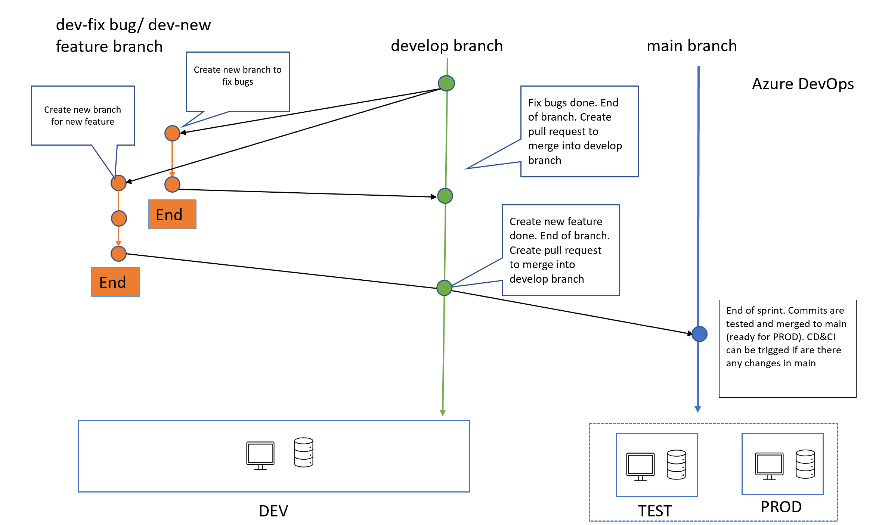

# Branching Strategy

This document explains how to handle setup of your code repository to support a Continuous-Integration/Continuous Deployment (hereafter, CI/CD) process. In this document, we use uppercase DEV, TEST, PROD to refer to the Development, Test, and Production environments and lowercase when referring about branches for development and main (hereafter, dev, main).

## Design

The following diagram summarizes the recommended strategy and how it relates to the Azure resources.

## Architecture Recap

We provide the recommended general guidelines:

1. Each DS project should have at least two resource groups with with one Azure Machine Learning (hereafter, AML) instance in each: development and production resource group. We recommend, however, that developers implementing the solution also setup a test resource group.

2. The code in DEV must be able to be run in TEST/PROD without applying any change to it. Promotion of code from DEV to TEST/PROD environments is outside the scope of this document.

## Branching

1. Create a dev branch from main from which one can create sub branches (feature engineering, hot fixes, etc).

2. Continuous Integration consists in running: linting, unit tests, data checks,..., and finally publishing an AML pipeline (either training or serving).

3. Any change applied to the main branch must be done through a Pull request. The approved PR may trigger a continuous integration process in TEST/PROD.
